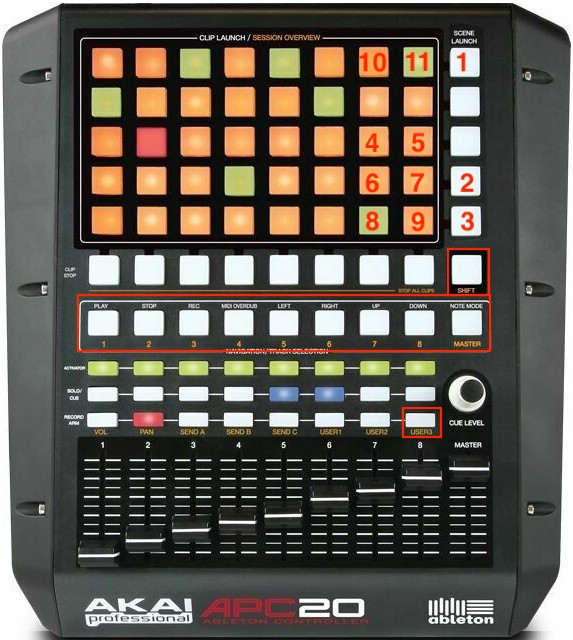

# APC20 Device Control
Remote script for Akai APC20 controller with added few features:
- Device Control on `USER3` sliders bank
- Tap tempo
- Reversed functionality of track selection buttons

This is 2nd version of the script. For v1 go [here](https://github.com/tomekskuta/APC20_DC/tree/v1).

## How it works

All numbered buttons work only if `SHIFT` is pressed:
- `1` - Tap tempo
- `2` - Show/hide detail view
- `3` - Toggle between Device view selector and Clip view selector
- `4` - On/off selected device
- `5` - Lock/unlock selected device to control
- `6` - Switch to previous bank on device
- `7` - Switch to next bank on device
- `8` - Switch to previous device on chain
- `9` - Switch to next device on chain
- `11` - Phase nudge down
- `12` - Phase nudge up

On image I also marked button for `USER3` bank which you can activate with pressed `SHIFT` as well. Then sliders are are controlling selected device.

#### `Navigation/Track selection` buttons
It's unexpected thing but when I added device control feature functionality of these buttons reversed. Now if you push some of these buttons corresponding track will be selected. `PLAY`, `STOP`, `REC`, `MIDI OVERDUB`, navigation and `NOTE MODE` works if `SHIFT` is pressed.
Navigation buttons switch between tracks and scenes banks instead of single tracks and scenes (works like zooming session overview). It's something I don't know how to fix for now.
In general I like this reverse feature so I decided to leave it as it is now.

## How to use it
- [clone the repo](https://docs.github.com/en/repositories/creating-and-managing-repositories/cloning-a-repository)
- copy `/dist/APC20_DC` catalog following [this instruction](https://help.ableton.com/hc/en-us/articles/209072009-Installing-third-party-remote-scripts)
- Assign `APC20_DC` remote script to `Akai APC20` controller in the `Link MIDI` tab in Ableton Live preferences.

## Limitations
I use original APC20 remote script from Ableton Live 10 which is written in Python2 so it probably **works only with AL10 and lower**. Remote scripts for AL11 are written with Python3.

Additional features buttons are highlighted initially. They turn off after pressing `SHIFT` button once and then are working normally.

### TODO
- Fix navigation buttons to switch between single track/scene instead of whole banks
- Fix initially highlight of new features buttons

Probably I won't fix these bugs - the script works good enough and those things aren't too important to spend more time on them ;)